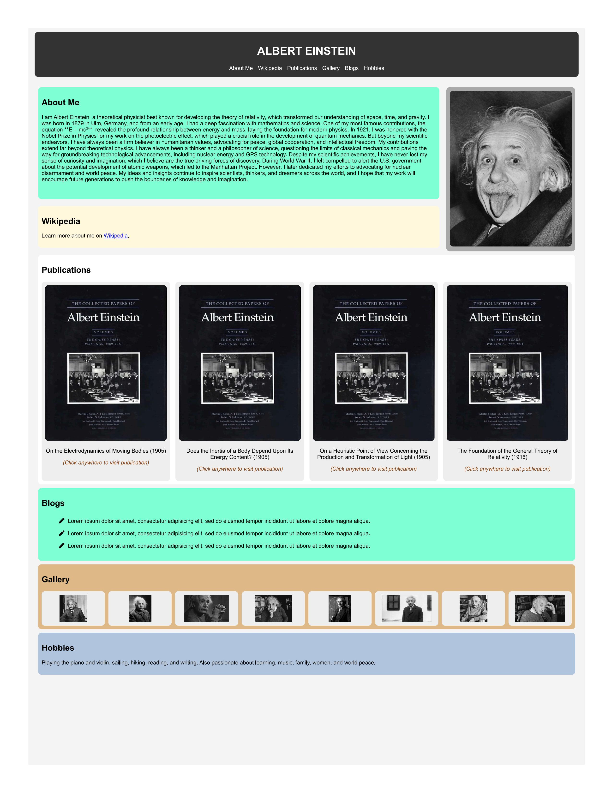

## 📘 Project Overview

This project is a static, responsive **profile-style web page** inspired by an informational layout, designed to present structured content such as biography, publications, blogs, gallery, and hobbies in a clean and visually organized format.

The page is built entirely using **HTML5**, **CSS Grid**, and **vanilla JavaScript**, with a strong emphasis on layout design, content hierarchy, and responsiveness. CSS Grid is used extensively to create a balanced two-column and multi-section layout, allowing text-heavy content and images to coexist cleanly without clutter.

JavaScript is used to enhance interactivity and navigation across sections, while maintaining a lightweight and fast-loading experience. The design focuses on readability, visual separation of sections, and an intuitive user flow.

This project demonstrates core front-end skills including semantic HTML structuring, modern CSS layout techniques, and basic DOM manipulation using JavaScript.

---

## 🖼️ Project Preview

  

